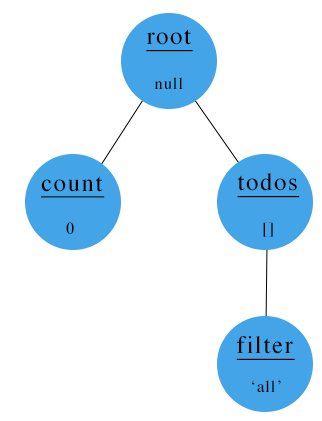

# Treeful
[![npm version][npm-img]][npm-url]

It's a(nother) state manager! But let's not get overwhelmed. Treeful will simply do the following 4 things to your app.

1. Single global object that contains all states.
2. Update the states.
3. Subscribe to subset of the states.
4. Run a callback function when the subscribed set is updated.

### Install
```sh
npm install treeful
```

## Why Treeful?

1. **Less code** - One of the strongest merit. Minimal lines of code will be sufficient. No extra files needed.
2. **Tree structure** - Your state can be nested, and subscribing to parent will automatically subscribe to its child nodes as well.
3. **Efficient data transfer** - We don't pass around whole tree. Only the subscribed set will be passed for efficiency.
4. **Pluggable into all frameworks** - You won't need any wrappers to use it in a framework. Keep your code as is.

### Example

First, import the library and create your tree

```js
import Treeful from 'treeful';
Treeful.addNode('count', 0); //Add node 'count' with value 0 (to 'root').
Treeful.addNode('todos', [], 'root'); //Add node 'todos' to 'root'.
Treeful.addNode('filter', 'all', 'todos'); //Add node 'filter' to 'todos' with value of 'all'.
```

Our tree now looks like this:



Subscribe to `'todos'` node by calling:
```js
Treeful.subscribe('todos', callbackTodos);
//callbackTodos will get called when the data in 'todos' or 'filter' changes
```

Get and set data data by calling:
```js
let oldFilter = Treeful.getData('filter'); //oldFilter = 'all'
let newFilter = 'completed';
Treeful.setData('filter', newFilter);
//Node 'filter' is updated, and it is a child of 'todos' that is subscribed to callbackTodos.
```

callbackTodos is now called, and passed the new data
```js
function callbackTodos(data, node) {
    //data = 'completed'
    //node = 'filter' (node that changed)
    //do some stuff
}
```

To run all examples at http://localhost:3000:

```sh
git clone https://github.com/justinjung04/treeful.git
cd treeful
npm install
npm start
```

For source codes, please refer to [example](example).

## Methods

### addNode(id, [data, parent])
Add a node to Treeful object.
* `id` (string) - unique string id.
* `data` (anything but function, optional) - data to be stored in the node. It can be in any type except function. Default is `null`.
* `parent` (string, optional) - string id of a parent node. Default is `root`.

**Returns** Treeful object. Allows addNode to be called in a chain.

### setData(id, data)
Sets data in a node.
* `id` (string) - string id of a node.
* `data` (same as existing data type) - data to be set in the node. Data type CANNOT be modified.

### getData(id)
Gets data in a node.
* `id` (string) - string id of a node.

**Returns** Data in the node

### subscribe(id, callback, [ignoreChildren])
Assigns a callback function to a node. The callback function is triggered when the node or its child nodes get updated.
* `id` (string) - string id of a node.
* `callback` (function) - function to be triggered when the node or its child nodes get updated.
* `ignoreChildren` (boolean, optional) - option to ignore children. If set to `true`, updates of child nodes won't trigger the callback function. Default is `false`.

**Returns** Unsubscribe function that removes the assigned callback function from the node.

### destroy()
Resets the tree.

## Contribute
Join the party - please refer to [CONTRIBUTING](CONTRIBUTING.md).

## License
MIT - please refer to [LICENSE](LICENSE).

[npm-url]: https://www.npmjs.org/package/treeful
[npm-img]: https://img.shields.io/npm/v/treeful.svg