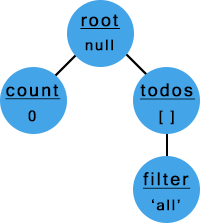

# Treeful
[![npm version][npm-img]][npm-url] [![build status][travis-img]][travis-url] [![coverage status][coveralls-img]][coveralls-url] [![monthly downloads][downloads-img]][downloads-url]

It's a(nother) state manager! But let's not get overwhelmed. Treeful simply provides the following to your app.

* Single global object contains all states.
* Subset of the states can be subscribed with callback functions.
* States can be updated.

That's it. No steep learning curve, no configuration. And regardless of its simplicity, Treeful has distinct characteristics that makes it powerful.

* **Less code** - Minimal lines of code are sufficient. No extra files needed.
* **Tree structure** - Your state can be nested, and subscribing to parent will automatically subscribe to its children.
* **Efficient data transfer** - You won't pass around whole tree. Only the subscribed set will be passed for efficiency.
* **Framework independent** - No wrappers needed. Keep your code as is.

### Install
```sh
npm install treeful
```

### Basic Usage
First, import the package and create your tree (you don't need to instantiate)

```js
import Treeful from 'treeful';
Treeful.add('count', 0)             // Add node 'count' with value 0 (to 'root')
    .add('todos', [], 'root')       // Add node 'todos' to 'root'
    .add('filter', 'all', 'todos'); // Add node 'filter' to 'todos' with value of 'all'
```

Our tree now looks like this:



Subscribe to node `'todos'` by calling:
```js
Treeful.subscribe('todos', callbackTodos);
// callbackTodos will get called when the data in 'todos' or 'filter' gets updated
```

Get and set data by calling:
```js
let oldData = Treeful.get('filter'); // oldData = 'all'
Treeful.set('filter', 'completed');
// Node 'filter' is updated, and it is a child of 'todos' that is subscribed to callbackTodos
```

callbackTodos is now called, and passed the new data
```js
function callbackTodos(data, node) {
    // data = 'completed' (updated data)
    // node = 'filter' (node that changed)
    // do some stuff
}
```

### Documentation
APIs and examples - please refer to [documentation](https://jsful.gitbooks.io/treeful/content/motivation.html).

### Contribute
Join the party - please refer to [contributing](https://github.com/jsful/treeful/blob/master/CONTRIBUTING.md).

### License
MIT - please refer to [license](https://github.com/jsful/treeful/blob/master/LICENSE).

[npm-url]: https://www.npmjs.org/package/treeful
[npm-img]: https://img.shields.io/npm/v/treeful.svg
[downloads-url]: https://www.npmjs.org/package/treeful
[downloads-img]: https://img.shields.io/npm/dm/treeful.svg
[travis-url]: https://travis-ci.org/jsful/treeful?branch=master
[travis-img]: https://travis-ci.org/jsful/treeful.svg?branch=master
[coveralls-url]: https://coveralls.io/github/jsful/treeful?branch=master
[coveralls-img]: https://coveralls.io/repos/github/jsful/treeful/badge.svg?branch=master